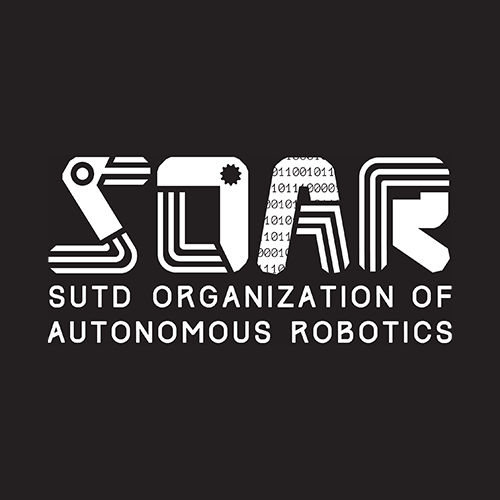
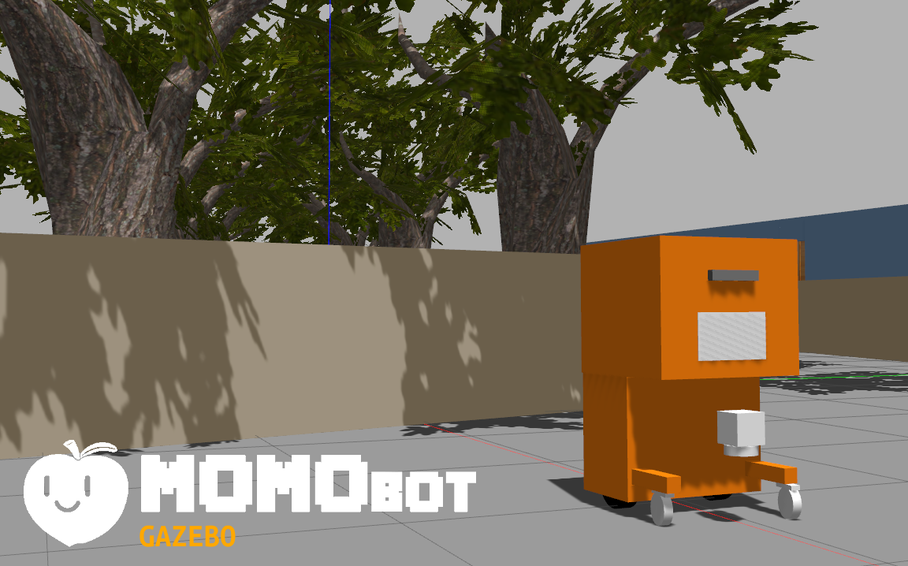
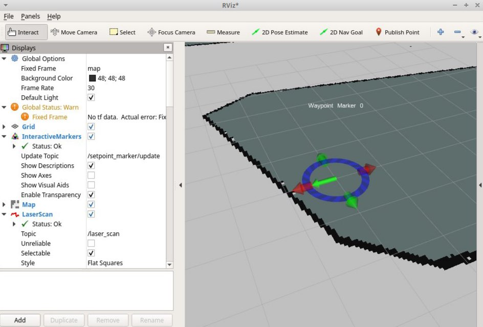
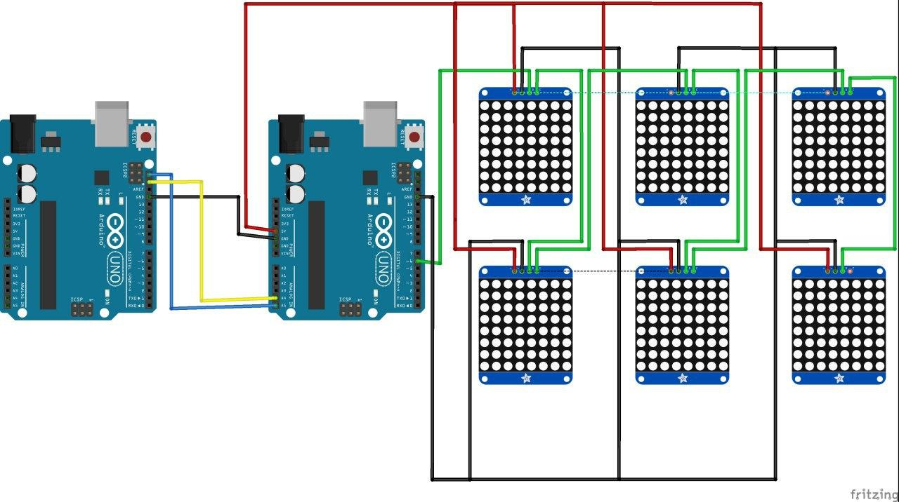
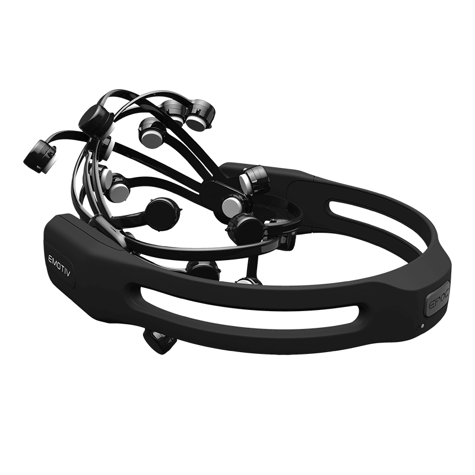

# Verendum
List of SOAR robotic projects 🤖

> **Reference & Extra Resources**
> [Here are some references and resources you may find useful!](resources.md)

## On-going
### [MOMOBot](https://github.com/sutd-robotics/momobot) 🍑

MOMObot (MOdular MObile Robot) is a ROS enabled autonomous ground vehicle for service by the SUTD Organisation of Autonomous Robotics (**SOAR**)!

### [SUTDoggo](https://github.com/sutd-robotics/SUTDoggo) 🐕
An adaptation of the Stanford Doggo Project for SUTD SOAR.

### [Jessica Arm](https://github.com/sutd-robotics/JESSICA-SOAR)
JESSICA is a robot arm that can automatically serve coffee upon activation. We plan to add a manual function, where users can control JESSICA with an EMG myosensor armband. ☕

## Completed/Archived

### [Gazebo Model](https://github.com/sutd-robotics/momobot_gazebo)

Tested on Gazebo9, the model is used to simulate MOMOBot with various packages and algorithms in a virtual environment.

### [Waypointgen](https://github.com/sutd-robotics/waypointgen)

A waypoint generator (using InteractiveMarkers in Rviz) and a waypoint server for waypoint playback.

### [NeoPixel Display](https://github.com/sutd-robotics/ROS-NeoMatrix-Scrolling-Text)

A ROS package to display text and animation on a 8x8 *Neopixel* matrix with Arduino, attached onto the side of momobot. (Made up of 6 matrix display)

### [Machine Learning/AI](https://github.com/sutd-robotics/SOAR-ML)
Exploring MNIST digit recognition via Tensorflow & Keras, and to create a gesture detctor ROS package using the YOLO3 model.

### Teleoperation of robot via EEG headset 🧠

Controlling the robot wirelessly via Electroencephalography (aka `Brain Wave`) with the Emotiv Cortex2. 

> Below are the relevant libraries/pacakges used.

**teleop_twist_brain_bridge**

Brain Teleoperation rosbridge Nodes for ROS!

[https://github.com/methylDragon/teleop_twist_brain_bridge](https://github.com/methylDragon/teleop_twist_brain_bridge)

**Emotiv Cortex2 Python Client**

Unofficial Python client for the Emotiv EEG Cortex 2 API.

[https://github.com/methylDragon/emotiv-cortex2-python-client](https://github.com/methylDragon/emotiv-cortex2-python-client)

**Demo**

### Linobot

Linorobot is a suite of Open Source ROS compatible robots that aims to provide students, developers, and researchers a low-cost platform in creating new exciting applications on top of ROS.
- [2019 Edition](https://github.com/sutd-robotics/soar-linorobot)
- [2018 Edition](https://github.com/sutd-robotics/linorobot)

### Singapore AUV Challenge (SAUVC) ⚓
Challenges participant teams to build an AUV which can perform AUV navigation, visual identification, acoustic localization and robotic manipulation.
- [bubblesjr](https://github.com/sutd-robotics/bubblesjr)
